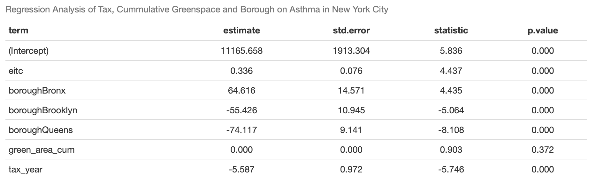

&nbsp;

&nbsp;

&nbsp;

&nbsp;

&nbsp;

&nbsp;

&nbsp;

&nbsp;

::: {align="center"}
# [Welcome to our FINAL PROJECT]{style="color: red;"}
:::

&nbsp;

&nbsp;

&nbsp;

&nbsp;

&nbsp;

&nbsp;

&nbsp;

&nbsp;

&nbsp;

&nbsp;

&nbsp;

&nbsp;

&nbsp;

&nbsp;

&nbsp;

&nbsp;

&nbsp;

::: {align="center"}
### Our Motivation
:::

&nbsp;

::: {align="center"}

:::

&nbsp;

&nbsp;

&nbsp;

&nbsp;

&nbsp;

&nbsp;

&nbsp;

&nbsp;

&nbsp;

&nbsp;

&nbsp;

&nbsp;

&nbsp;

&nbsp;

&nbsp;

&nbsp;

&nbsp;

::: {align="center"}
### 4 Datasets & Variables
:::

&nbsp;

::: {align="center"}

:::

&nbsp;

&nbsp;

&nbsp;

&nbsp;

&nbsp;

&nbsp;

&nbsp;

&nbsp;

&nbsp;

&nbsp;

&nbsp;

&nbsp;

&nbsp;

&nbsp;

&nbsp;

&nbsp;

&nbsp;

::: {align="center"}
### Multivariable Analyses
:::

&nbsp;

::: {align="center"}

:::

&nbsp;

::: {align="center"}

:::

&nbsp;

::: {align="center"}

:::

&nbsp;

&nbsp;

&nbsp;

&nbsp;

&nbsp;

&nbsp;

&nbsp;

&nbsp;

&nbsp;

&nbsp;

&nbsp;

&nbsp;

&nbsp;

&nbsp;

&nbsp;

&nbsp;

&nbsp;

::: {align="center"}
### Final Model: Design
:::

&nbsp;

::: {align="center"}

:::

&nbsp;

&nbsp;

::: {align="center"}
### Final Model: Output
:::

::: {align="center"}

:::