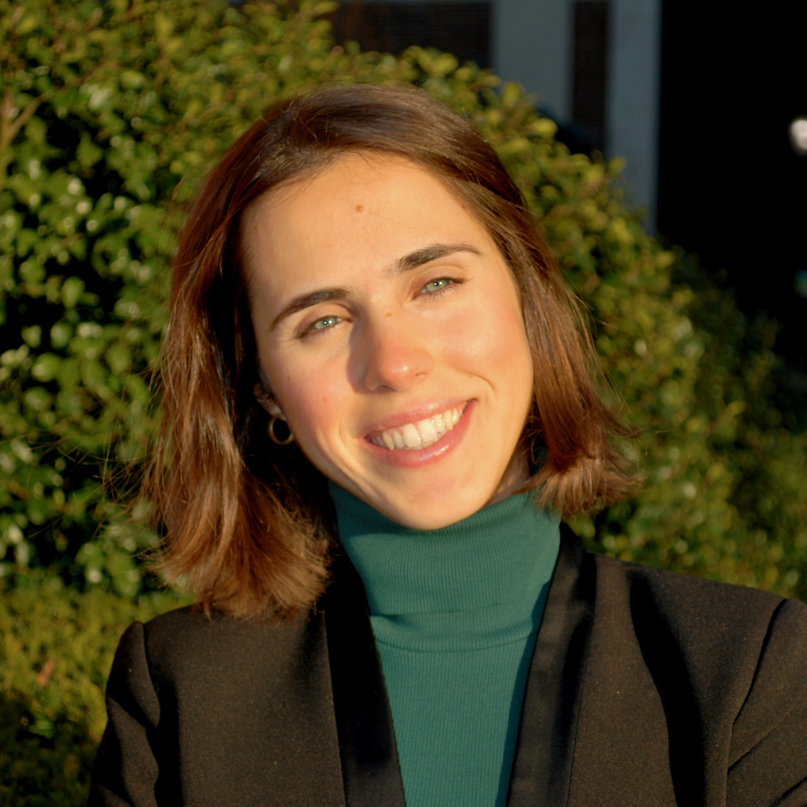
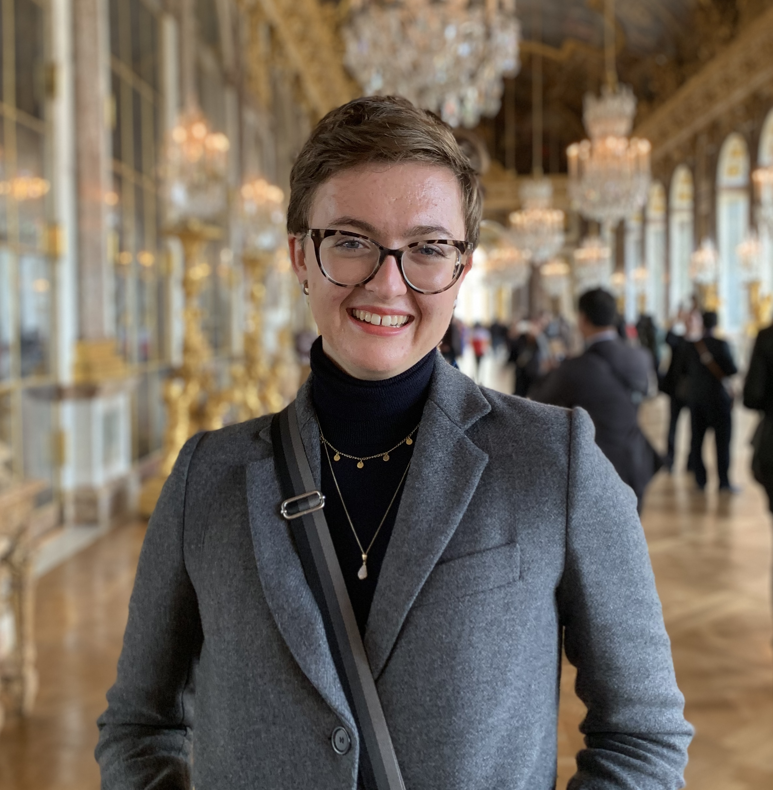
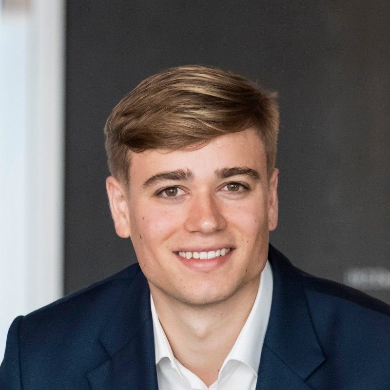
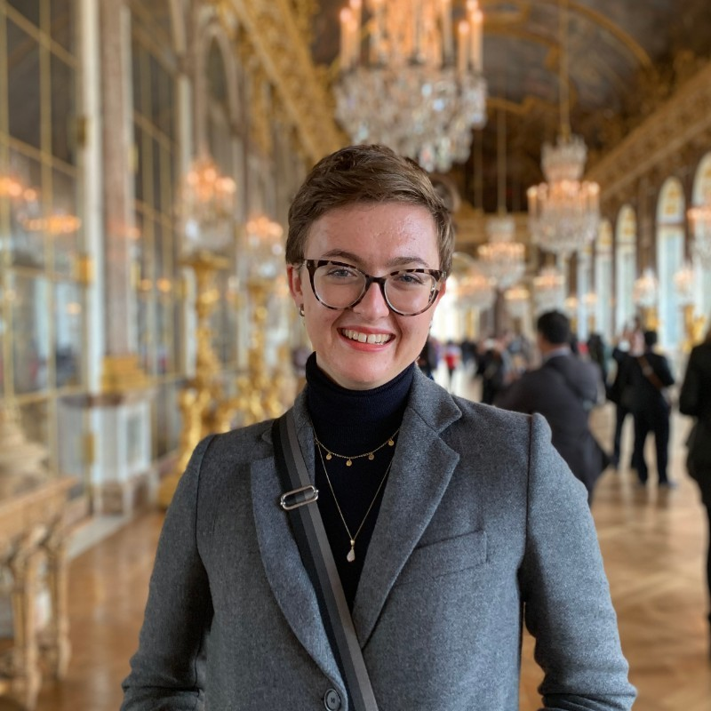
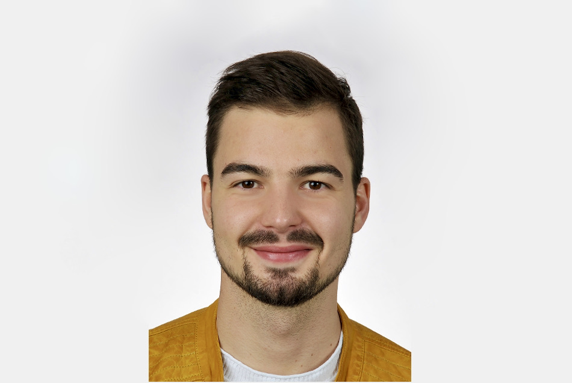

#### Mallafre Larrosa, Meritxell

<<<<<<< HEAD
-   [Email](mailto:<mm5951@cumc.columbia.edu>)
-   [LinkedIn](https://www.linkedin.com/in/meritxellml/)
=======
#### Warshaw, Emma: 

-   [Contact here](mailto:<ew2718@cumc.columbia.edu>)
-   [LinkedIn](https://www.linkedin.com/in/emma-warshaw-a8047b151/)
-   Emma specializes in Population and Family Health, health policy, and data science, bringing an interdisciplinary approach to this project.  She is interested in using data science to create better policy that puts the health of individuals and families first.
>>>>>>> 029775c55f8b32b7ba506f3aa8b08147c9135df7

Meritxell is a Medical Doctor (MD, University of Barcelona, 2020) in pursuit of a career at the intersection of Cancer Control and Global Health Governance. As such, she brings a breadth of practical experience to this project and pushes all members through her quantitative and qualitative data skills.
In relation to this project, coming from one of the most beautiful places in the world, she is interested in the effect of green spaces in the context of a highly urbanized environment (NYC).

#### Hauser, Tim

-   [Email](mailto:<th2899@cumc.columbia.edu>)
-   [LinkedIn](https://www.linkedin.com/in/hausertim/)

#### Warshaw, Emma

-   [Email](mailto:<ew2718@cumc.columbia.edu>)
-   [LinkedIn](https://www.linkedin.com/in/emma-warshaw-a8047b151/)

#### Kim, Esther

-   [Email](mailto:<ei2262@cumc.columbia.edu>)
-   [LinkedIn](https://www.linkedin.com/in/kim-h-esther/)

#### Hess, Niklas

-   [Email](mailto:<nh2706@cumc.columbia.edu>)
-   [LinkedIn](https://www.linkedin.com/in/niklas-hess/)

Niklas brings an international perspective, coupled with expertise in analytics and experience in Consulting and Private Equity, to this project. As such, he is interested in solutions that have business value and have successfully been implemented in other parts of the world. 
In relation to this project, he tries to go beyond theoretical findings, uncovering realities that can immediately be tackled.
