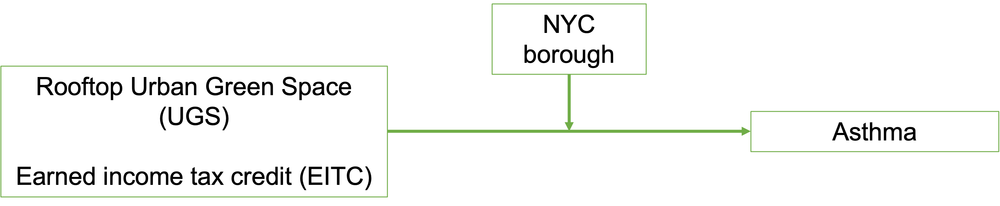

<p>&nbsp;</p>
::: {align="center"}
# [Welcome to our Final Project]{style="color: red;"}
:::

<p>&nbsp;</p>
This website is constructed as the final deliverable for the ***P8105 final project*** and can we found **[HERE](https://github.com/EmmaWarshaw/P8105_Group_Project.github.io){style="color: red;"}**. Before jumping into the actual analysis, four main topics need to be explained.

1.    **Our Team** and how we each contribute
2.    **Key Motivations** and **Related Work** that will show the intention behind this project
3.    **Research Questions** of this projects
4.    **The Data** that is used throughout the project

The outcome of our work is something we are very excited about and hope will be the starting point of more research. Additionally, like every good public health professional, it is our goal to support positive change - the findings of this project provide initial insights that individuals, organizations, and governments can directly act upon. For quick overview, please check-out our **Screencast** here:

::: {align="center"}
```{r echo=FALSE, warning=FALSE}
library("vembedr")

embed_url("https://vimeo.com/779995401")
```
:::

<p>&nbsp;</p>
::: {align="center"}
## Our Team
:::

The beauty of a final project within this format is the ability to present important information beyond the data outputs. Since a groups work is based on individuals and their own lived experiences, we want to take this opportunity to present our team to you. With 5 members and 5 unique perspectives on this project, please feel free to click [**HERE**](about.html) to find out more.

    
    
    
<p>&nbsp;</p>
::: {align="center"}
## Motivation
:::

1.  **Location Matters:** Anyone active in Public Health will know that location is one of the most important determinants of health. One of the key examples of this is redlining - referring to a discriminatory US practice that saw predominantly black neighborhoods being disadvantaged by withholding loans, public spending, and more. While redlining as a "known" practice might be an atrocity of the past, the underlying importance of ones living location continues to matter A LOT. Just think about implicit biases, access to education, environmental factors, and density of healthcare providers. As such, it was very clear to this group that our project needed to incorporate some type of location factor.

2.  **Public Health is EVERYTHING:** One of the most influential lectures for this group at Mailman was with Professor Merlin. He started by describing what Public Health really meant. Just healthcare? Gun violence? Income distribution? Access to work? Clean water? The correct answer was: [*ALL OF THE ABOVE*]{.underline}

    Public Health is a unique field, as it is broad beyond most peoples imagination - everything ones sees in ones daily life is connected to Public Health in one way or another. As such, it was important to this group to touch upon a number of different factors while working on this project. To us, only by considering a number of factors, could we do justice to Professor Merlin and the education we have received at Mailman.

3.  **Systems Thinking:** Of course, when considering a number of different Public Health factors, some key challenges arise. Most importantly, "how do those factors interact with one another?"

    Within Public Health, this question is tackled by systems thinking. Simply put, your access to education influences your access to work, which in turn influences your income and investments within your community, which ultimately influence your neighborhoods access to education.

    For this group, applying systems thinking meant looking beyond individual analysis, but combining all data-sets to understand how green spaces, income, health, and temperature could all influence one another. The findings are fascinating and can be found *here*.
    
<p>&nbsp;</p>
::: {align="center"}
## Related Work
:::

This project was inspired by a [data set](https://ecologyandsociety.org/vol27/iss3/art20/) examining the distribution of green roofs in New York City through a lens of social, ecological, and technological filters. This study examined the presence of rooftop greenspaces in New York City, noting that although about 20% of NYC landscape is covered in buildings, rooftop greenspace is only detected in a small fraction of those areas. We were interested in comparing rooftop greenspace to additional variables that can give a better overall understanding of the social determinants of health in the five boroughs.


<p>&nbsp;</p>
::: {align="center"}
## Research Questions
:::

Our initial goal was to understand how rooftop urban green space correlated with 3 other predictors individually: asthma rates, temperature data, and earned income tax credit (EITC) amounts in each borough. We originally hoped to use temperature, asthma rates, and EITC as predictors of cumulative green space area, stratified by borough.

However, as we progressed through the project, we began to rethink our outcome variable for the overall model. Since we’re interested in public health outcomes, we decided to use asthma as the outcome variable in a full regression model. Because of data limitations and a univariate comparison between our temperature data and greenspace proved to not be significant, we excluded temperature from the overall model.

::: {align="center"}

:::

Manipulating these data sets taught some valuable lessons, namely how much effort goes into data collection and wrangling. It also showed us that studying the social determinants of health is extremely challenging. We were able to piece together data sets that showed us the individual elements we wanted to model, but the reality is that it would be better if all of these factors were coming from a single unified, health-systems informed study. That being said, we were still able to find meaningful insight with what we had to work with.

<p>&nbsp;</p>
::: {align="center"}
## The Data
:::

The project at its core is based on four main data-sets. Each of them is geographically based in New York City, and we managed to combine all of them through a location variable that specifies the NYC neighborhood. To understand how exactly they interact with one another, let's jump into each:

##### [Urban Greenspace](UGS.html)

-   Roofs planted with vegetation — **Urban Green Spaces (UGS)** — can help cities adapt to a changing climate by absorbing storm water, lowering local temperatures, and providing insulation that cuts indoor heating and cooling costs. Using **a publicly available dataset**, which includes data from n=736 UGS as of 2016, we conduct a secondary analysis to draw links to economical, clinical and environmental factors that could potentially be associated with the distribution of UGS within New York City (NYC).

##### [Tax Credits](tax_data.html)

-   One way to get a general understanding of socioeconomic status of a geographic area is to look at Earned Income Tax Credit (EITC) data, as it is designed to give a tax credit to low-to-moderate income workers and families. Using this data, we aim to understand the financial status of residents in each borough and explore its relationship with urban design, clinical and environmental factors.

##### [Temperature](temp.html)

-   The *Temperature Analysis* explores the daytime surface temperature and heat vulnerability index scores of the 5 boroughs in NYC. Neighborhoods with higher surface temperatures tend to have more heat-exacerbated deaths associated with extreme heat events. The daytime surface temperature shows which neighborhood is more at-risk due to higher surface temperatures. The heat vulnerability index further expands on the notion that hotter neighborhoods are more at-risk of heat illness and death. Based on a number of social and environmental factors, the heat vulnerability index is scored on a 5-point scale (1 being lowest at-risk and 5 being highest at-risk). Both the daytime surface temperature and heat vulnerability index provide a better understanding of which neighborhood is most at-risk of heat illness and heat-exacerbated deaths. 

##### [Asthma](asthma.html)

-   Heightened asthma rates are one of the negative health outcomes resulting from high population density of cities (and resulting high density of environmental toxins being released into the atmosphere). We sourced data from the New York State Department of Health website, showing the number and rate of asthma hospitalizations and emergency department (ED) visits in New York State by age groups, sex, year, and total population. Through the data, we aim to understand how the asthma burden of asthma is distributed across the different borough, as well as analyse whether there have been any changes over time. 

##### [Joint Analysis Dashboard](analysis.html)

-   Most importantly, we aim to explore the relationship between the four aforementioned data-sets, applying systems thinking to our analysis. In doing so, we first establish individual relationships (greenspace and temperature, asthma and greenspaces, etc.) and ultimately construct one large regression model with all significant factors included. It is important to note that the final model faces several limitations, which will be explored in detail.
